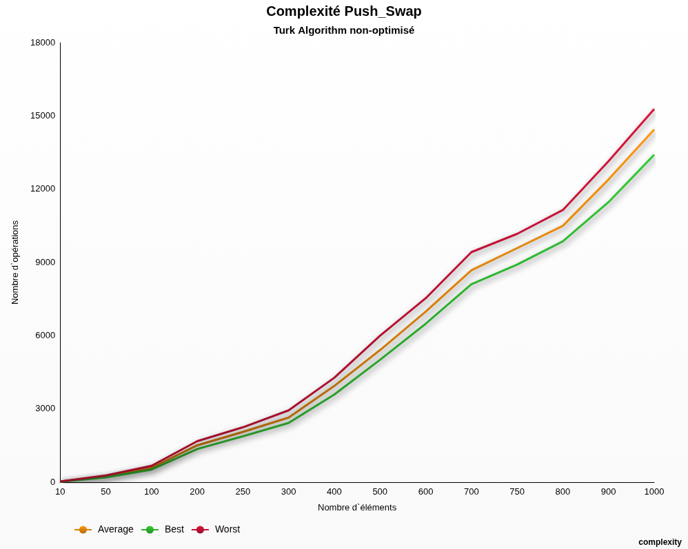

# Push_Swap
 
 

Push_Swap is a project from the 2nd Milestone of the 42 Common Core.
The aim of this project is to take a look at sort algorithms and optimization.

To complete this project, I used the Turk Algorithm, but Radix sort is also an option (less optimized).
You can find more informations about Turk Algorithm [here](https://pure-forest.medium.com/push-swap-turk-algorithm-explained-in-6-steps-4c6650a458c0).

Here is a chart about my program's efficiency. All the test are based on 500 iterations on each stack sizes.

